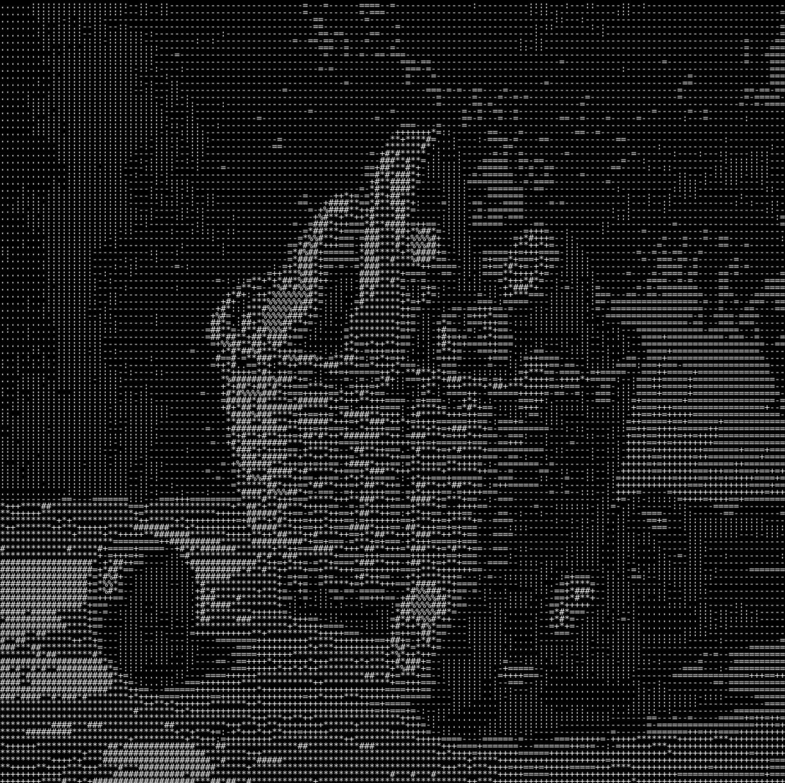

# gfy

A CLI tool that converts images into ascii art.

<p float="left">
    
    
</p>


The usage is quite simple. A user has to specify input and output files.
The `ascii_cols` parameter is used during image downsampling process and essentially
determines how many "pixel blocks" are created.

```
Usage: gfy [OPTIONS] -f <INPUT_FILE> -o <OUTPUT_FILE>

Options:
  -f <INPUT_FILE>
  -o <OUTPUT_FILE>
  -a, --ascii-cols <ASCII_COLS>  Determines how many ascii chars is in one row [default: 250]
  -h, --help                     Print help
  -V, --version                  Print version
```
